# Community Garden

## Purpose

The purpose of the Community Garden website is to:
* develop user interest in the community garden
* encourage users to visit the community garden
* share location information
* share various means of contacting the garden
* connect users to sources of the latest event information and news

The website is targeted at people who want to learn how to grow fruit and vegetables, people who want to grow vegetables but do not have a garden of their own, people who want access to fresh organic fruit and vegetables, and people interested in activities through which they can get to know other people in the same community. 

## User Stories 

* As a visiting user of this site, I want to know what makes this community garden special so I can decide whether it is worth visiting.
* As a visiting user of this site, I need to know what kind of activities take place at the garden and who they are for so that I can decide whether to participate.
* As a visiting user of this site, I need to know the location of the garden so that I can go there.
* As a visiting user of this site, I need access to news about events so that I can participate. 

## Features

### Fixed Navigation Bar

The navigation bar contains a link to each page. It is fixed at the top of each page so that it is always visible and easy to find. It allows the user to easily navigate between pages, and uses color to draw the user's attention to the Call to Action ('Contact Us' button).

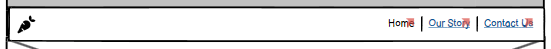

### Footer Containing Links to Social Media 

The footer contains links to the social media accounts connected to the website (Facebook, Instagram, Youtube). A title appears ('Follow us on Facebook') when the user's mouse hovers over one of the icons, encouraging the user to click. These links make it easy for the user to connect with and follow the Community Garden's social media accounts.  

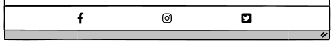

### Google Map Showing Location

The iframe map shows the location of the garden on Google. The user can interact with the map-zoom in, zoom out, find their current location-in order to make it easy to locate and visit the garden. 

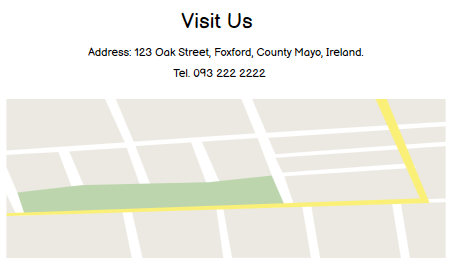

### Subscribe Form 

The subscribe form contains first name, last name and email input fields. Users can input this information if they want to receive news updates and information about events by email. The garden can share good information with users, keep in touch with users and publicise events.  

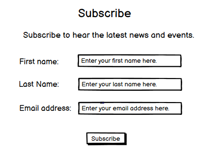

### Article Sharing Background and 'Why'

The 'Our Story' article shares the story behind the garden, why it was started and how it has grown over time. It includes both text and photos. It allows users to read and decide whether the values of the garden align with their own and whether they would like to become part of the garden community.

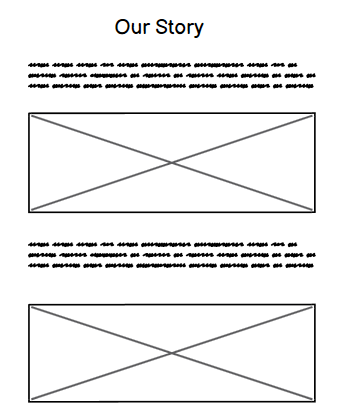

### 'What We Do' Section on Home Page

The 'What we do' section shares the main activities of the garden. The user can discover whether the garden will likely host activities that interest them, that they would like to participate in, or that they would like to find out more about.

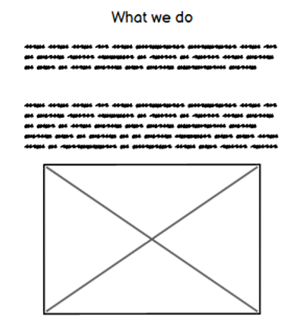

### 'Who We Are' Section on Home Page

The 'Who We Are' section introduces the people behind the garden. It allows the users to 'meet' them. 

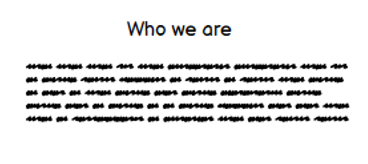

## Future Features

* An events section or page sharing event details, times, days, how to participate, etc.
* A gallery page sharing photos from recent events.

## Typography and Color Schemes 

### Typography

* Montserrat is used for headings and Merriweather for body text. 

### Color Scheme

* Green is used as the base color and background color for the navigation and footer sections, and appears in all of the images. Green was chosen due to its association with nature and gardens, fitting the theme of the website. 
* Orange is used as an accent color and for call-to-action buttons as it provides a strong contrast with green.
* All background and foreground color combinations on the website meet WCAG AA color contrast requirements. Color contrast was checked using [Web AIM](https://webaim.org/resources/contrastchecker/).

## Wireframes

### Page 1 of 3: The Home Page 

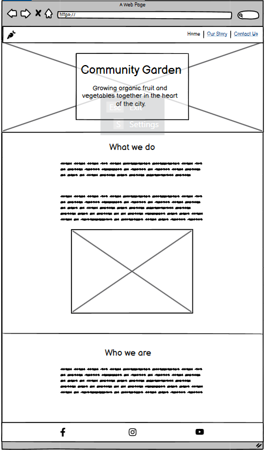 

### Page 2 of 3: Our Story

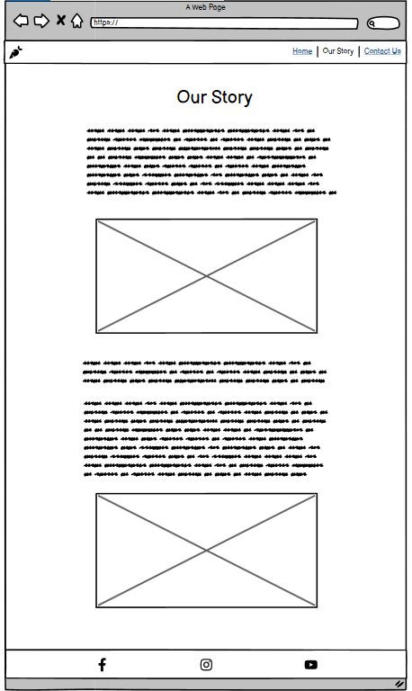 

### Page 3 of 3: Contact Us

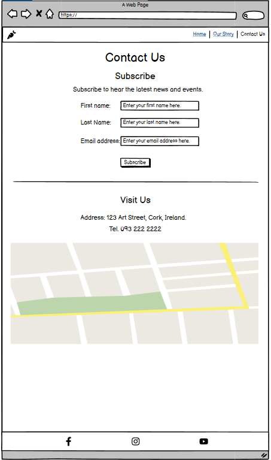

### Subscribe Confirmation Page

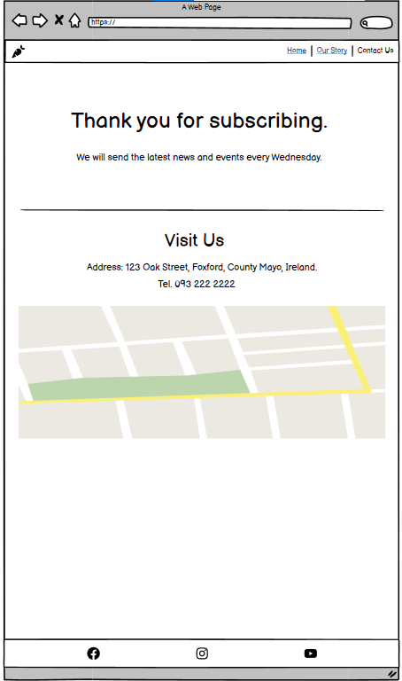

### Pages 1 and 3 on a smaller mobile phone screen 

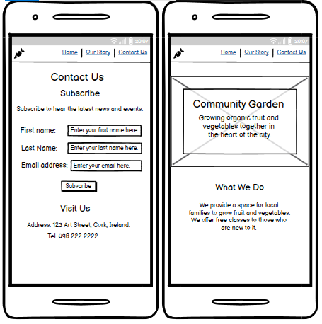

## Technology

* HTML was used to structure the pages and add features.
* CSS was used to style the pages and features.
* Github was used to store and to share the repository.
* Gitpod was used to edit the code.
* Balsamiq was used to create wireframes during the planning phase.
* Chrome DevTools was used to check responsiveness and for debugging.
* Font Awesome was used to source icons.
* Google Maps is used to provide an interactive map showing the location of the garden.

## Testing

### Code Validation

* The HTML code was validated using the [W3C Markup Validation Service](https://validator.w3.org/). No errors were found.
* The CSS code was validated using the [W3C CSS Validation Service](https://validator.w3.org/). No errors were found.

### Test Cases 

#### The Home Page

1. Open the home page. The user is shown the hero image and main heading. The user notices that there is more text below the hero image. 
2. Scroll down. The user is shown the What We Do section.
3. Read the What We Do section. The user notices that there is an image below. 
4. Scroll down. The user is shown the What We Do image.
5. Look at the image. The user notices that there is more text below.
6. Scroll down. The user is shown the Who We Are section text.
4. Read the Who We Are section. The user notices that there are social media icons in the footer.
5. Hover the mouse over the Facebook icon. A 'Visit our Facebook page' message appears.
6. Click on the Facebook icon. The user is directed to the Facebook page.

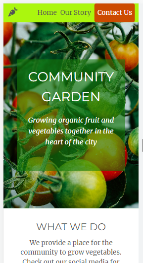
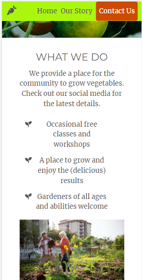
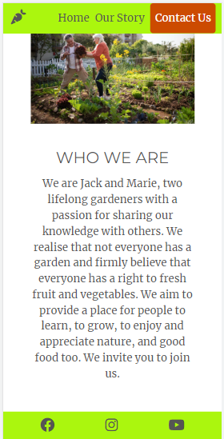

#### Our Story

1. Open the home page. The user notices the 'Our Story' button in the navigation bar.
2. Click on 'Our Story'. The user is directed to the Our Story page.
3. Read the heading and opening text. The user notices that there is an image below. 
4. Scroll down. The user is shown an image.
4. Look at the image. The user notices that there is more text below. 
5. Scroll down. The user is shown the next part of the article text.
5. Read the text. The user notices that there is another image below. 
6. Scroll down. The user is shown the second article image.
6. Look at the image. The user notices the social media icons at the bottom of the page.

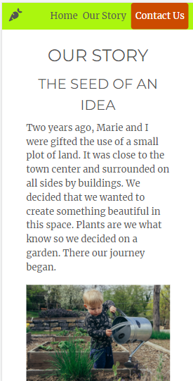
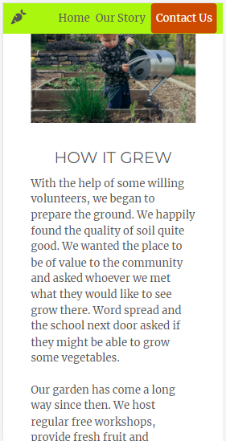
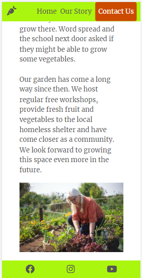

#### Contact Us

1. Open the home page. The user notices the Contact Us button in the navigation bar.
2. Click on the Contact Us button. The user is directed to the Contact page.
2. Read the subscribe section heading. The user notices the subscribe form.
3. Enter your first name and click subscribe. A message appears asking the user to enter their last name.
4. Enter your last name and click subscribe. A message appears asking the user to enter their email address.
5. Enter your email address and click subscribe. The user is directed to the Confirmation page.

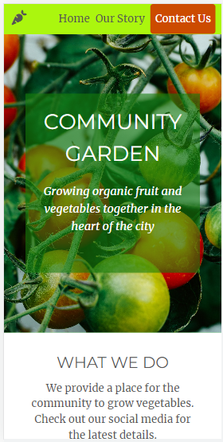 
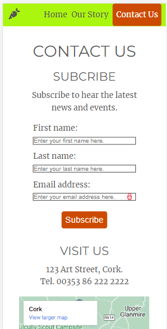
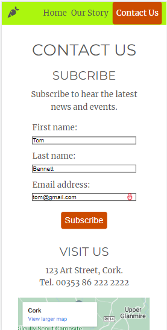 
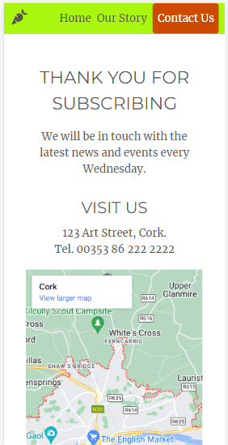

### Fixed Bugs

* The list items in the What We Do section appeared on top of the fixed navigation bar when they reached the top of the page instead of disappearing under it. This was fixed by adding a z-index style declaration (with high positive value) to the CSS code applied to the navigation bar.

* A white space appeared under the footer bar on the Contact and Confirmation pages when viewed at 50% in Chrome DevTools. This was fixed by increasing the size of the iframe map so that it occupied more vertical space. 

### Supported Screens and Browsers

* A mobile-first approach was taken for design. Media queries were used to accommodate screen widths from 320px up to 1200px. 
* The website was tested on the following devices using the simulator in Chrome DevTools: Google Pixel 5, iPhone 12 Pro, Samsung Galaxy S8, Samsung Galaxy A51, Samsung Galaxy S20 Ultra, iPad, iPad Air.
* It has not been tested on browsers other than Chrome. 

## Deployment

### Via Gitpod

To open up the site in Gitpod, follow the following steps:

1. Go to http://github.com.
2. Open up the 'SiobhanP1/community-garden' repository.
3. Click 'Gitpod' to open up a workspace in Gitpod.
4. Enter the command `python3 -m http.server` in the terminal to open a port.
5. A small box will appear. 
6. Click 'Open in browser' to open the site in a new tab. 

### Via Github Pages

The site was deployed to Github Pages by following the steps below.

1. Open up the 'SiobhanP1/community-garden' repository in Github.
2. Click 'Settings'.
3. Click 'Pages' (located in the sidebar under Code and Automation).
4. Select 'Deploy from Branch' from the Source drop-down menu.
5. Select 'Main' from the Branch drop-down menu.
6. Click 'Save'.
7. Wait a minute then refresh the page to see the site link.

The live link is https://siobhanp1.github.io/community-garden/.

## Credits

### Images

* The hero image of [tomatoes](https://unsplash.com/photos/4LiUI-Y2mI8) on the home page was taken from [Unsplash](http://www.unsplash.com). 
* The image of the [man and woman gardening](https://www.pexels.com/ko-kr/photo/7658795/) on the home page was taken from [Pexels](http://www.pexels.com).
* The image of the [small boy watering](https://unsplash.com/photos/ffJ8Qa0VQU0) on the Our Story page was taken from [Unsplash](http://www.unsplash.com). 
* The image of the [woman gardening](https://www.pexels.com/ko-kr/photo/7658811/) on the Our Story page was taken from [Pexels](http://www.pexels.com).
