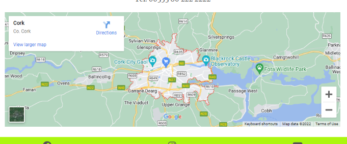
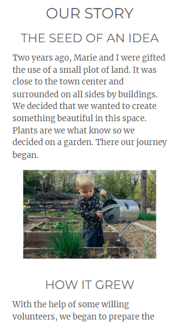
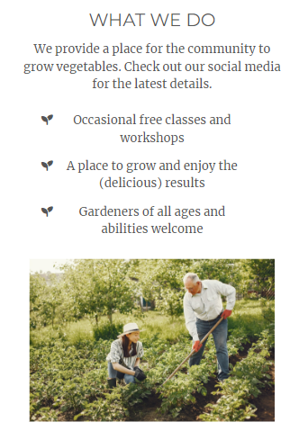
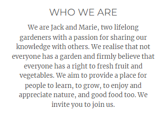
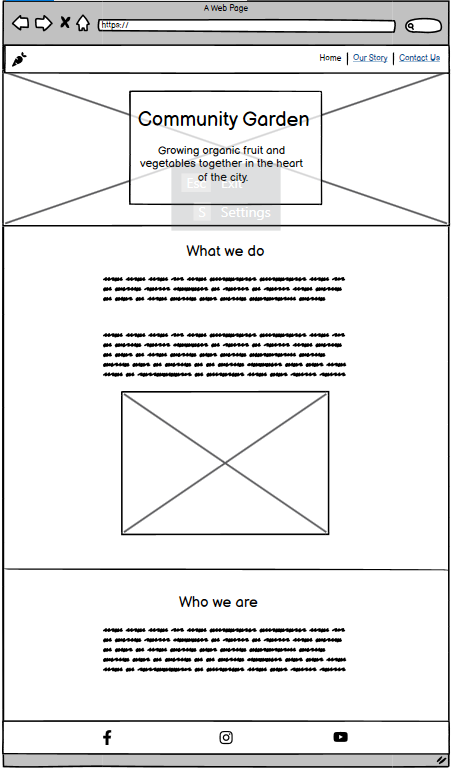
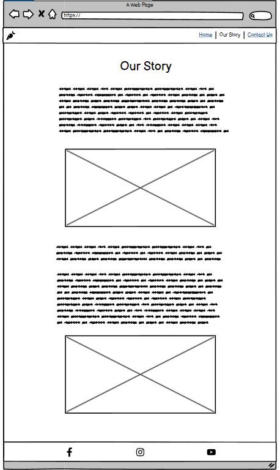
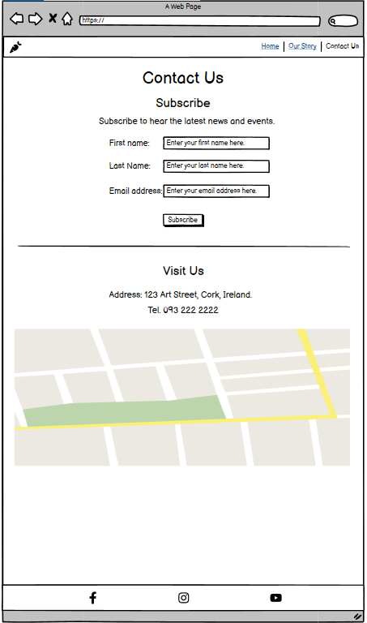
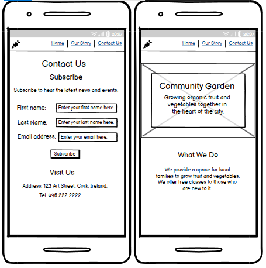

# Community Garden

## Purpose

The purpose of the Community Garden website is to:
* develop user interest in the community garden
* encourage users to visit the community garden
* share location information
* share various means of contacting the garden

The website is targeted at people who want to learn how to grow fruit and vegetables, people who want to grow vegetables but do not have a garden of their own, people who want access to fresh organic fruit and vegetables, and people interested in activities through which they can get to know other people in the same community. 

## User Stories 

* As a visitor to this site, I want to know what makes this community garden special so I can decide if it is worth visiting. 
* As a visitor to this site, I need to know the location so that I can go there.
* As a visitor to this site, I need to know what the opening hours are so that I can visit.
* As a visitor to this site, I need to know how I can find news about events so that I can participate. 
* As a busy visitor to this site, I need to receive news about events so that I don't miss out.

## Features

### Navigation Bar

A navigation bar located in the header of each page and containing links to each page. 

### Footer Containing Links to Social Media 

A footer containing links to social media pages at the bottom of each page. 

### Google Map Showing Location

An interactive map showing the location of the community garden. 

### Subscribe Form 

A form containing first name, last name and email input fields for users to subscribe to a weekly news email.

### Article Sharing Background and 'Why'

An article sharing the story and reason (the 'why') for the community garden with both text and photos.

### 'What We Do' Section on Home Page

A 'What we do' section on the home page sharing the main activities.

### 'Who We Are' Section on Home Page

A 'Who we are' section on the home page allowing users to 'meet' the people running the community garden.  

## Future Features

* An events section or page sharing event details, times, days, how to participate, etc.
* A gallery page sharing photos from recent events.

## Typography and Color Schemes 

### Typography

* Montserrat is used for headings and Merriweather for body text. 

### Color Scheme

* Green is used as the base color and background color for the navigation and footer sections, and appears in all of the images. Green was chosen due to its association with nature and gardens, fitting the theme of the website. 
* Orange is used as an accent color and for call-to-action buttons as it provides a strong contrast with green.
* All background and foreground color combinations on the website meet WCAG AA color contrast requirements. Color contrast was checked using [Web AIM](https://webaim.org/resources/contrastchecker/).

## Wireframes

### Page 1 of 3: The Home Page 

 

### Page 2 of 3: Our Story

 

### Page 3 of 3: Contact Us

### Pages 1 and 3 on a smaller mobile phone screen 

## Technology

## Testing

1. Code Validation

2. Test Cases (user story with screenshots)
3. Fixed Bugs
4. Supported Screens and Browsers

## Deployment

1. Via Gitpod
2. Via Github Pages

## Credits